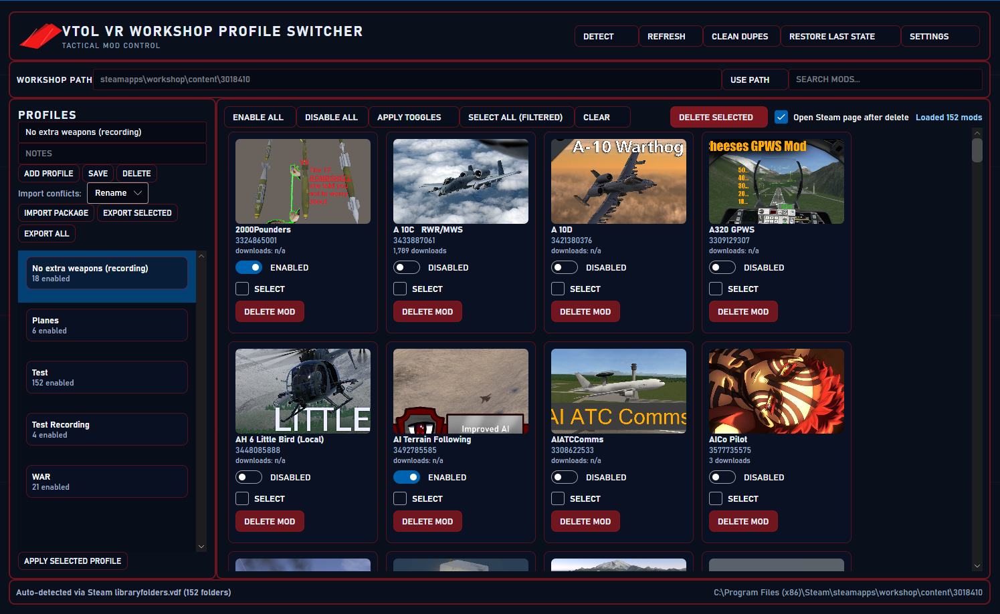

# VTOL VR Workshop Profile Switcher

Switch VTOL VR Steam Workshop mod setups in seconds using reusable profiles.

If you like this project, please consider giving it a star on GitHub.

## TL;DR

`VTOL VR Workshop Profile Switcher` scans your VTOL VR Workshop folder, lets you save named mod profiles, and applies them by renaming mod folders between enabled (`<WorkshopId>`) and disabled (`_OFF_<WorkshopId>`) states. It also supports live refresh, logs, and snapshot backups before changes.

## Requirements

This tool only helps you manage and switch between already downloaded mods. It requires the official VTOL VR Mod Loader and existing Workshop mods to function.

- Install the official VTOL VR Mod Loader from Steam first.
- Download your mods through the Mod Loader before using this app.
- This tool does not install, update, or download mods.
- This app is a helper/profile manager for mods you already have.
- It does not replace the official Mod Loader.

## Screenshots




## Feature Overview

| Feature | Included |
| --- | --- |
| Auto-detect VTOL VR Workshop path from Steam libraries | &#10003; |
| Manual Workshop path override | &#10003; |
| Detect enabled/disabled mods from folder naming | &#10003; |
| Save and load named profiles | &#10003; |
| One-click apply profile (folder rename engine) | &#10003; |
| Snapshot backup before apply | &#10003; |
| Restore latest snapshot | &#10003; |
| Live folder refresh / watcher | &#10003; |
| Search/filter and bulk toggle mods | &#10003; |
| Logging (operations and crash logs) | &#10003; |
| Built-in Steam Workshop page opening after delete | &#10003; |
| CLI mode | &#10007; |
| Drag-and-drop mod package import | &#10007; |

## How to Use

1. Scan and review mods.
Open the app, confirm the Workshop folder path (`steamapps/workshop/content/3018410`), and let it scan your mods.

2. Create a profile.
Enable/disable mods in the UI, then save that selection as a named profile (for example, `PvE Coop` or `Vanilla+`).

3. Apply when needed.
Select a saved profile and click apply. The app renames folders to match your profile and creates a snapshot backup first.

## Installation

### Option 1: Use a Release Build (Recommended)

1. Open the repo's `Releases` page.
2. Download the latest installer or packaged build for Windows.
3. Install and launch `VTOLVRWorkshopProfileSwitcher`.

### Option 2: Build from Source (.NET 8)

Requirements:

- Windows
- .NET 8 SDK
- Steam with VTOL VR Workshop content installed

```powershell
dotnet restore .\VTOLVRWorkshopProfileSwitcher.sln
dotnet build .\VTOLVRWorkshopProfileSwitcher.sln -c Release
dotnet run --project .\src\VTOLVRWorkshopProfileSwitcher\VTOLVRWorkshopProfileSwitcher.csproj
```

Optional installer build (requires Inno Setup 6):

```powershell
.\scripts\build-installer.ps1 -Configuration Release -Runtime win-x64 -Version 1.0.0
```

## Safe Usage, Backups, and Warnings

- Close VTOL VR before applying profile changes.
- The app changes mod state by renaming Workshop folders.
- A snapshot backup is created before profile apply.
- Keep your Steam Workshop content fully synced before switching profiles.
- If anything looks wrong, use restore snapshot before making more changes.

Data locations:

- `%LOCALAPPDATA%\VTOLVR-WorkshopProfiles\profiles` - saved profiles
- `%LOCALAPPDATA%\VTOLVR-WorkshopProfiles\backups` - apply snapshots
- `%LOCALAPPDATA%\VTOLVR-WorkshopProfiles\logs\app.log` - app logs
- `%USERPROFILE%\Documents\VTOLVR-WorkshopProfiles\logs\crash.log` - crash logs
- `%LOCALAPPDATA%\VTOLVRWorkshopProfileSwitcher\thumbnail-cache` - image cache

## Troubleshooting / FAQ

### The app cannot find my Workshop folder

Use manual path override and point to:
`<SteamLibrary>\steamapps\workshop\content\3018410`

### My mods did not switch as expected

Close VTOL VR and Steam, reopen the app, rescan, then apply again. If needed, restore the latest snapshot backup.

### A mod is missing metadata or thumbnail

This can happen when Steam metadata is unavailable. The mod can still be managed by Workshop ID.

### I applied a profile and now want to go back

Use the restore snapshot action to revert to the last pre-apply state.

### Where are logs?

See the paths in the Safe Usage section above.

## Community Requests / Questions

We want your feedback and ideas:

- What features should we add next?
- What integrations would help your workflow most?
- What workflow improvements would make profile switching faster?
- What UX changes would make the app easier to use?
- Do you have mockups or concept ideas we should explore?

Please open a GitHub issue for feature suggestions, workflow ideas, UX suggestions, and concept/mockup proposals.

## Roadmap (Optional)

- CLI support for scripted profile switching
- Profile or mod package sharing/import/export
- Drag-and-drop workflow improvements
- Quest-related compatibility ideas
- Multi-platform support improvements

## Contributing

Issues and pull requests are welcome. Small fixes, UX improvements, bug reports, and feature requests all help.
